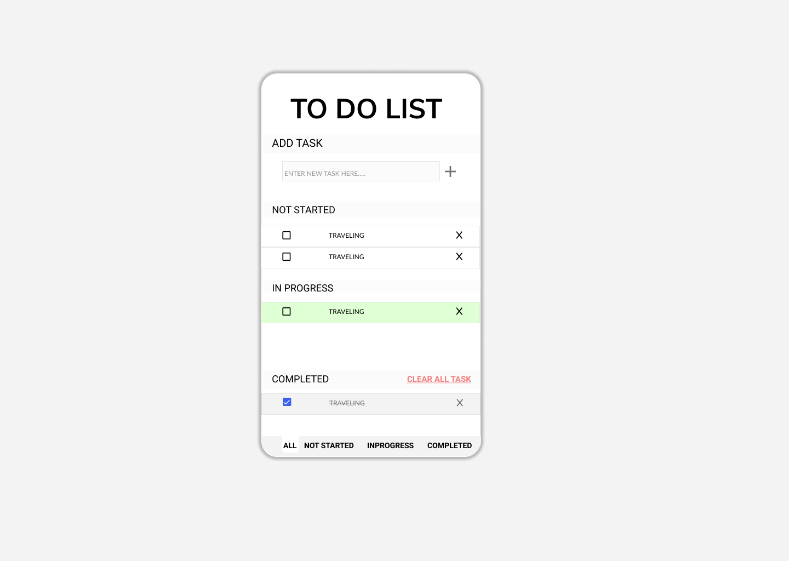

# **Advance TO-DO APP**🕺
>using HTML CSS and js and drag and drop API only.
## **Project Progress**
>DAY1: 05-08-2021 - PLANING
### *Things to implement*
* Tasks should be editable
* There will be four  sections namely
    * Add Task
    * >will have a text box and add button 
    * Not started
    * >will have a tile of task with checkbox text and close button and *On click can be converted into text box to edit* 
    * In Progress
    * >same task will have tile of task with different color maybe *green* to show task is going on 
    *  Completed
    * >this will have task with checkbox as checked and tile color as grey and text strike through style this section also have clear all task on header
* Each task can be dragged to other one

* delete task by cross button
* There will be *FOUR TABS* on the footer namely
    * All
    * Not Started 
    * Footer 
    * In progress
    * completed

>DAY2: 06-08-2021 Design Prototype 

#### *TEXT-COLORS*
* APP HEADING TEXT(TODO LIST) and other text: 
>*rgba(0, 0, 0, 1)* | *#000000* | *hsla(0, 0%, 0%, 1)*
* completed task text: 
>*rgba(119, 112, 112, 1)* | *#777070* | *hsla(0, 3%, 45%, 1)*
* heading of subsection background:
>#F0F0F03D | rgba(240, 240, 240, 0.24) | hsla(0, 0%, 94%, 0.24)
* Task tile border style
>1px solid #E5E5E5  
* Inprogress Task tile border style
>1px solid  hsla(104, 100%, 92%, 1) *background is also same*
* compeleted Task tile border style
> hsla(0, 0%, 95%, 1)

